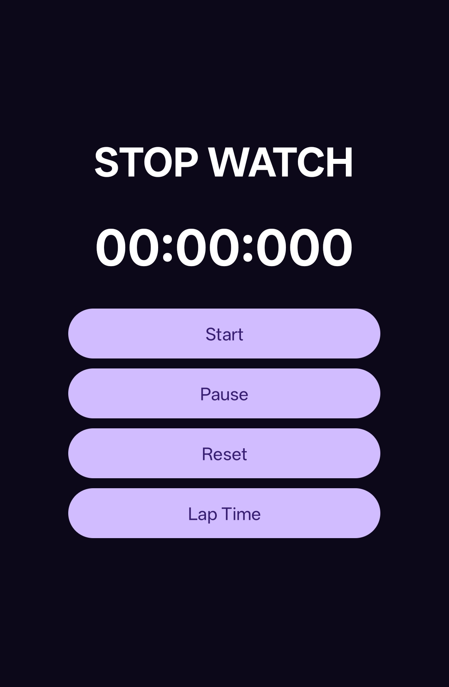
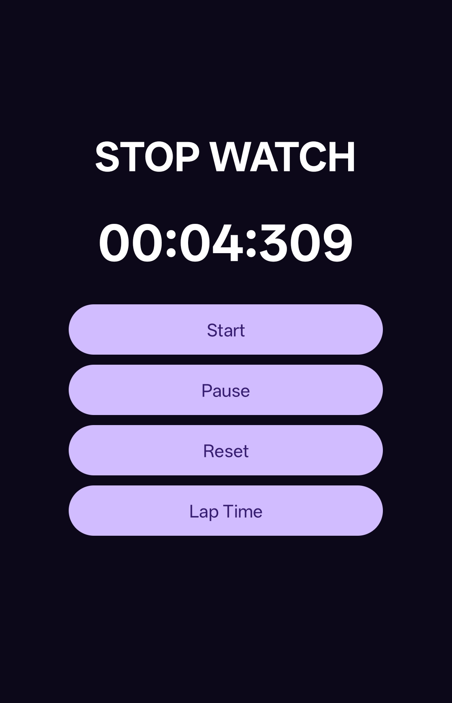
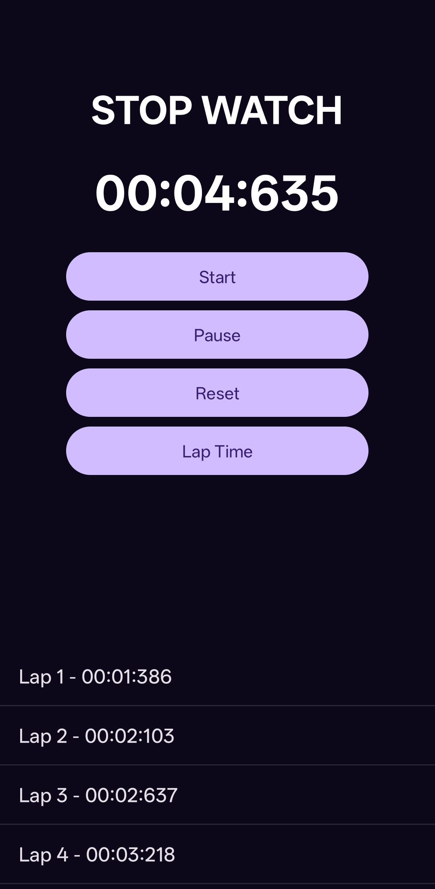

# ⏱️ Stopwatch App

A simple Android Stopwatch application developed using Java and Android Studio.

## 🚀 Features

* Start Stopwatch
* Pause Stopwatch
* Reset Stopwatch
* Display Minutes, Seconds, and Milliseconds
* Record Lap Times
* View Lap Time History
* User-Friendly Interface

## 🛠️ Technologies Used

* Java
* Android Studio
* XML
* Handler

## 📸 Screenshots

### Start Stopwatch

### Pause Stopwatch

### Reset Stopwatch

### Lap Time History

## 🎯 Learning Outcomes

* Android UI Design
* Event Handling
* Time Management using Handler
* Stopwatch Functionality Implementation
* Dynamic List Handling
* Android App Development Fundamentals

## 📂 Project Structure

* MainActivity.java
* activity_main.xml

## 👨‍💻 Author

Daksh Gajjar

## 🔗 Internship

Task-03 completed as part of the Android Development Internship at Prodigy InfoTech.
